# OpenCode Skills & Agents — Research Template

This file lives at `.opencode/AGENTS.md` and is loaded automatically by OpenCode
into the system prompt for any session opened in this repo. Its sole job is to
tell the LLM **when to eagerly invoke** the research skills bundled in
`.opencode/skills/`.

The user prefers **eager invocation**: skills are not slash commands they have to
remember. The LLM should detect intent and read the relevant SKILL.md.

## Agents NEVER Commit

**LLM agents in this repo are forbidden from running `git commit` under any circumstances.**

## Skill Activation Triggers (eager invocation)

When the user's message matches any of the patterns below, IMMEDIATELY READ the
corresponding `.opencode/skills/<name>/SKILL.md` file and follow its protocol.
Do not paraphrase the skill. Do not ask permission. Do not delay with clarifying
questions before reading the file — the file itself tells you whether to ask.

```dot
digraph eager_invocation {
  "User message" [shape=doublecircle];

  "User message" -> "research-session" [label="'what should I work on', 'catch me up', 'briefing', start of session"];
  "User message" -> "paper-read"       [label="PDF path / arXiv URL / 'read this paper' / 'discuss [paper]'"];
  "User message" -> "lit-search"       [label="'find papers on X', 'literature review', 'survey [field]', venue mentioned"];
  "User message" -> "research-companion" [label="'brainstorm', 'what if', 'should I try X?', 'evaluate this idea', mid-session idea proposal"];
  "User message" -> "weekly-review"    [label="'weekly review', 'progress check', 'what did I do this week'"];
  "User message" -> "vault-sync"       [label="'sync from vault', 'pull project notes', briefing reports drift"];
  "User message" -> "orchestrate"      [label="'parallel review', 'multi-angle analysis', complex multi-domain task"];
}
```



### Activation rules

| Trigger pattern | Skill to read |
|---|---|
| Session start, "what should I work on", "catch me up", "briefing" | `.opencode/skills/research-session/SKILL.md` |
| User shares PDF path, arXiv URL, DOI, paper title; says "read", "discuss [paper]", "ingest" | `.opencode/skills/paper-read/SKILL.md` |
| "find papers on X", "literature review", "survey", "map the field", venue + topic | `.opencode/skills/lit-search/SKILL.md` |
| "brainstorm", "what if", "should I try X", "evaluate this idea", mid-session research idea | `.opencode/skills/research-companion/SKILL.md` |
| "weekly review", "progress check", "digest", "what did I do this week" | `.opencode/skills/weekly-review/SKILL.md` |
| "sync from vault", "pull from primary vault", briefing reports drift | `.opencode/skills/vault-sync/SKILL.md` |
| Multi-agent / multi-angle / complex task with many concerns | `.opencode/skills/orchestrate/SKILL.md` |

### Priority when multiple match

1. If `research-session` triggers (start of session), run it first; it routes to the right sub-skill.
2. Otherwise pick the most specific match.
3. If unsure, ask the user briefly: "Sounds like you want X — should I run skill Y?"

## Sub-Agents (`.opencode/agent/`)

The research skills spawn sub-agents via the `task` tool. The available
sub-agents are:

- **brainstormer** — divergent idea generation (used by research-companion Phase 2)
- **idea-critic** — adversarial 7-dimension idea critique (used by research-companion Phase 3, by orchestrate, and by paper-read for harsh take-down)
- **research-strategist** — project-level strategy (continue/pivot/kill, comparative advantage, scooping risk; used by research-companion Phase 4 and orchestrate)

Each lives at `.opencode/agent/<name>.md`. Read them to know the agent's persona
before dispatching.

## Hook Awareness

The repo has a `hooks/research_hook.sh` script that fires on file writes and
appends events to `events.jsonl`. If your platform configuration in
`opencode.json` registers it, hooks fire automatically. If not, you can call
the hook explicitly after meaningful writes — pass the file path on stdin as
JSON, e.g.:

```bash
echo '{"tool_input":{"file_path":"wiki/topics/foo.md"}}' | bash hooks/research_hook.sh
```

The hook tracks but does **not** commit. Commits are exclusively the user's responsibility.

## State Awareness

- `research-state.yaml` at repo root — read on session start (research-session does this).
- `events.jsonl` at repo root — append-only log; read tail for recent context.
- `wiki/index.md` — content catalog; read before any wiki operation.

Never edit `events.jsonl` to "fix" history. Append only. The hook respects this.

## Vault-Mirror Awareness

`wiki/.vault-mirror/` is a one-way read-only mirror from the user's primary Obsidian
vault, populated by the vault-sync skill. **Never edit files inside
`wiki/.vault-mirror/`** — edits are overwritten on the next sync. Use it as input
material: grep for keywords, cite findings in wiki pages, surface insights when
relevant.

**Fidelity rule (do not extrapolate from vault-mirror).** Mirrored notes are
private shorthand the user wrote for themselves — often half-finished,
exploratory, or contradictory. Treat them as **evidence of what the user has
thought about**, not as prompts to elaborate on. When citing a mirrored note,
quote or paraphrase only what is literally there; do not "complete" a fragment
or infer what the user "probably meant". If a wiki page would benefit from
content beyond what the mirror contains, ask the user — do not invent. See the
"Fidelity Discipline" section in the repo-root `AGENTS.md` for the full rules.
